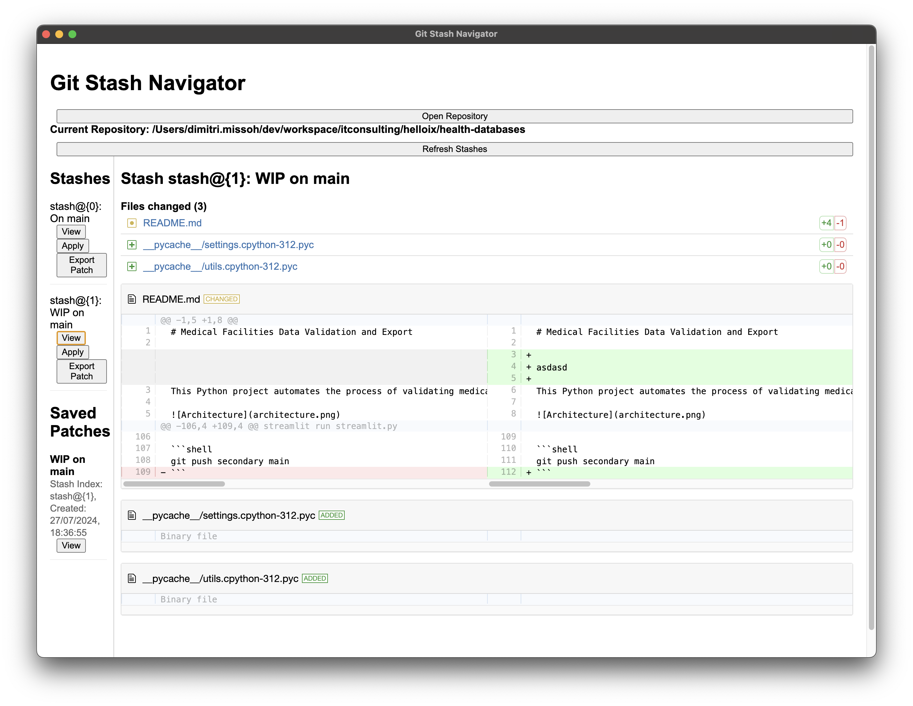

# Sauve



## Step 1: Initialize your project

```shell
npm init -y
```

## Step 2: Install Electron

```shell
npm install electron --save-dev
```

## Step 3: Create index.js file

## Step 4: Create index.html file

## Step 5: Update package.json

Update your package.json file to include a start script to launch the app.

```json
"scripts": {
    "start": "electron ."
},
```

## Step 6: Start Electron app

```shell
npm start
```
