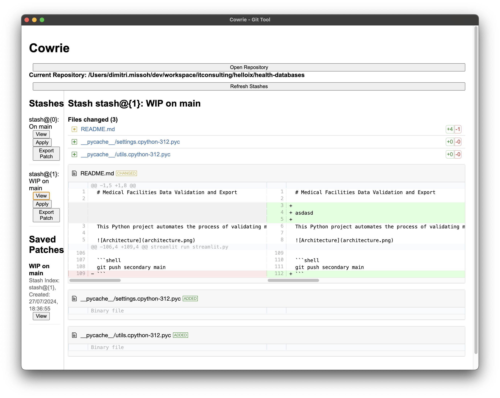

# Cowrie



**Cowrie**, inspired by the Cowrie, an African shell historically used as currency and for ornamental purposes, is an Electron-based desktop application designed to simplify and enhance the management of Git stashes.
This tool provides a user-friendly interface for developers to interact with their Git stashes, offering a visual and 
intuitive way to handle complex version control operations.

Key Features:

1. Repository Selection: Easily open and switch between different Git repositories.
2. Stash Listing: View a comprehensive list of all stashes in the current repository, complete with index numbers and descriptions.
3. Stash Visualization: Utilize the integrated diff2html library to view stash contents in a visually appealing, side-by-side diff format with syntax highlighting.
4. Stash Application: Apply selected stashes to your working directory with a single click.
5. Patch Export: Export stashes as patch files for easy sharing or archiving.
6. Saved Patches Management: Keep track of exported patches with a dedicated section, allowing for quick access and viewing.
7. Aesthetic Diff Presentation: Leverage the power of diff2html to present code changes in a clear, colorful, and easy-to-read format.

**Upcoming Feature**:

Unstaged Changes Export: Soon, users will be able to export the diff of unstaged changes (changes that have not been stashed) 
as a patch file. This feature will provide greater flexibility in managing and sharing code modifications.

## Step 1: Initialize your project

```shell
npm init -y
```

## Step 2: Install Electron

```shell
npm install electron --save-dev
```

## Step 3: Create index.js file

## Step 4: Create index.html file

## Step 5: Update package.json

Update your package.json file to include a start script to launch the app.

```json
"scripts": {
    "start": "electron ."
},
```

## Step 6: Start Electron app

```shell
npm start
```
